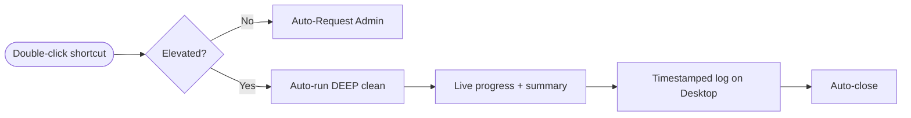

<div align="center">

# SystemCleanerPro

**Lightweight, Transparent Windows Optimization Engine**

[](https://microsoft.com)
[](https://microsoft.com/powershell)
[](https://github.com/Diwak4r)
[](LICENSE)

</div>

---

### Overview

**SystemCleanerPro** is a transparent, open-source Windows maintenance tool built with **PowerShell** and **Batch**. It is a lightweight alternative to proprietary utilities, purging junk and cache across 40+ categories without touching your registry, credentials, or critical system files.

**It is one-click.** Double-click the shortcut, approve the Administrator prompt, and it cleans automatically — no menu, no questions. You see live progress and a final summary, then it closes itself. A timestamped log is saved to your Desktop.

### Cleanup Execution Pipeline



### What a one-click run cleans (DEEP, safe scope)

`%TEMP%` · `%SystemRoot%\Temp` · browser caches across **all** profiles (Chrome, Edge, Brave, Firefox, **Arc, Vivaldi, Opera / Opera GX**) · **GPU shader caches (NVIDIA / AMD / Intel)** · DirectX shader cache · icon/thumbnail caches · Recent files · DNS flush · crash dumps & error reports · Prefetch · Windows Update download cache · Delivery Optimization · Windows logs · memory dumps · Recycle Bin · font cache · Store cache · Defender scan data · BITS cache · developer caches (`npm`, `pip`, `yarn`, `NuGet`, `Maven`, …) · AI/CLI tool caches · app caches (VS Code, Discord, Teams, Spotify, …) · **print spooler queue** · SSD TRIM.

The default run empties the Recycle Bin and clears the print queue.

### Advanced (manual) override

The one-click run always uses the safe **Deep** scope. Advanced users can pick a tier manually from a terminal:

| Tier | Duration | Scope |
| :--- | :--- | :--- |
| `Quick` | ~30s | Temp, browser & shader caches, DNS, thumbnails, crash dumps. |
| `Deep` *(default)* | ~2-5m | Everything above + Windows Update cache, dev/AI/app caches, GPU caches, recycle bin, print queue. |
| `Full` | ~5-15m | Everything in Deep **+ destructive ops**: DISM, Event Log clearing, `Windows.old`, `cleanmgr`, Restore Point pruning, SFC. Windows.old and restore-point removal ask for confirmation. |

```powershell
.\SystemCleaner.bat Quick     # or Deep, or Full
```

### Safety Principles

- 🔒 **Zero-Registry Mutation:** Does not modify registry hives or user credential stores.
- 🛡️ **Verification First:** Executes `Test-Path` checks before any file operation.
- 📜 **Full Audit Trace:** Writes detailed `[OK]`, `[SKIP]`, and `[FAIL]` status output to `Desktop\CleanerLogs\`.

### Quick Start

1. Download / clone this folder.
2. (Optional) Right-click `SystemCleaner.bat` → **Send to → Desktop (create shortcut)**.
3. **Double-click** it. Approve the Administrator (UAC) prompt.
4. That's it — it cleans, shows a summary, and closes itself. Log is on your Desktop under `CleanerLogs\`.

### Disclaimer

This tool is provided **"AS IS"**, without warranty of any kind. It deletes cache and temporary files. **You run it at your own risk.** The developer is **not responsible or liable** for any data loss, damage, or any consequence arising from its use. By running it you accept full responsibility.

---

<div align="center">
  <sub>Maintained by <a href="https://github.com/Diwak4r">Diwakar Yadav</a></sub>
</div>
