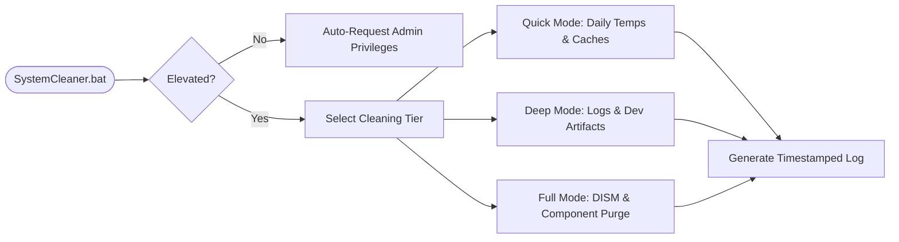

<div align="center">

# SystemCleanerPro

**Lightweight, Transparent Windows Optimization Engine**

[](https://microsoft.com)
[](https://microsoft.com/powershell)
[](https://github.com/Diwak4r)
[](LICENSE)

</div>

---

### Overview

**SystemCleanerPro** is a transparent, open-source Windows maintenance solution built with **PowerShell** and **Batch**. Designed as a lightweight alternative to proprietary utility tools, it automates daily, weekly, and monthly system purges across 30+ categories without compromising user privacy or critical system registries.

### Cleanup Execution Pipeline



### Cleaning Tiers Matrix

| Tier | Duration | Scope & Target Artifacts |
| :--- | :--- | :--- |
| **Quick Mode** | ~30s | `%TEMP%`, `%SystemRoot%\Temp`, Browser Caches (Chrome, Edge, Firefox, Brave), DNS Cache Flush, DirectX Shader Cache, Icon/Thumbnail Caches. |
| **Deep Mode** | ~2-5m | Everything in Quick + Prefetch, Windows Update Downloads, Memory Dumps, Developer Caches (`npm`, `pip`, `yarn`, `NuGet`, `Maven`), Application Caches (`VS Code`, `Discord`, `Teams`). |
| **Full Mode** | ~5-15m | Everything in Deep + DISM Component Cleanup, Event Log Clearing, `$Windows.~BT` Upgrade Residuals, Automated `cleanmgr`, Restore Point Pruning. |

### Safety Principles

- 🔒 **Zero-Registry Mutation:** Does not modify registry hives or user credential stores.
- 🛡️ **Verification First:** Executes `Test-Path` checks before any file operation.
- 📜 **Full Audit Trace:** Writes detailed `[OK]`, `[SKIP]`, and `[FAIL]` status output to `Desktop\CleanerLogs\`.

### Quick Start

```powershell
# Run preset Quick mode from PowerShell (Admin required)
.\SystemCleaner.bat Quick
```

---

<div align="center">
  <sub>Maintained by <a href="https://github.com/Diwak4r">Diwakar Yadav</a></sub>
</div>
